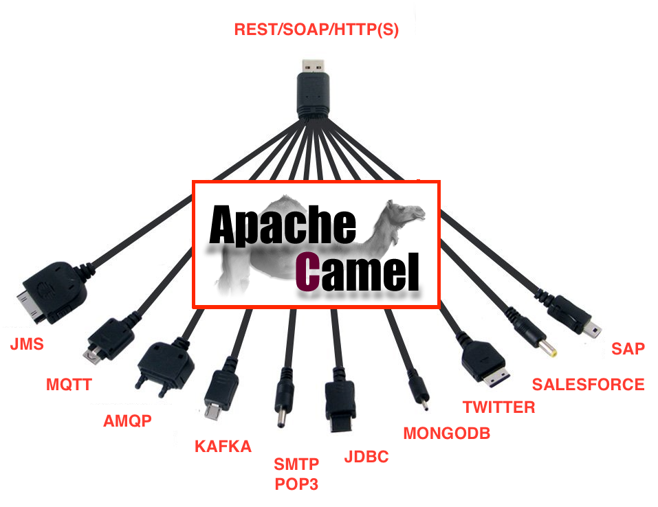
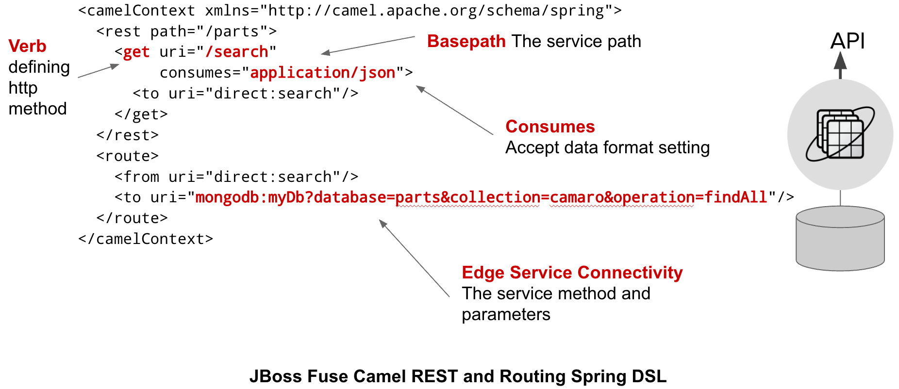
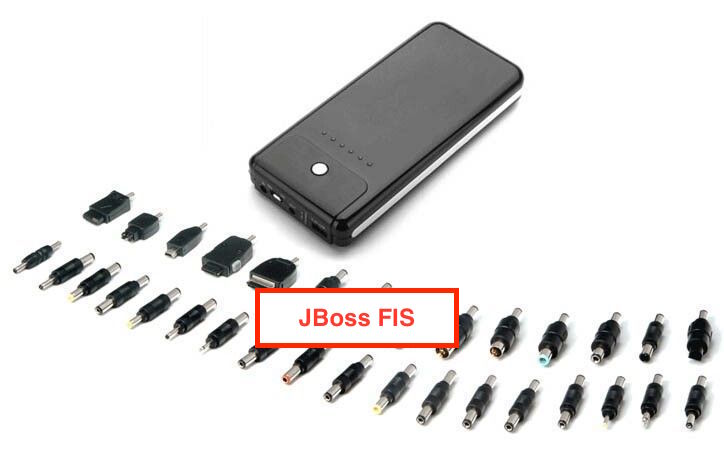

{: .image-right}As an Integration Architect I am pretty excited about the latest release from Red Hat. JBoss Fuse Integration Services 2.0 (FIS), went GA this week bringing a new level of simple, yet very powerful MSA framework to the OpenShift Container Platform (OCP). JBoss FIS 2.0 brings powerful and popular tools to organizations including:

 * JBoss Fuse Karaf and SpringBoot docker-formatted container images
 * Tools for the creation, development, and building of containerized JBoss Fuse applications
 * Self-service OCP deployment templates for common REST-to-Edge service integration scenarios
 * Native integration with Kubernetes for service discovery, clustering, and configuration management
 * Based on JBoss Fuse core technologies: Apache Camel, Apache CXF, Apache ActiveMQ
 

## More Than Just a Pretty Integration Platform

{: .image-right}As an architect and developer, JBoss Fuse gives me so many ways to tackle a problem with few limitations. It offers one of the most robust and feature rich integration platforms in middleware today. Bringing together Apache Camel with Apache CXF and Apache A-MQ messaging. JBoss Fuse includes several hundred out-of-the-box messaging protocols, patterns, and management components using unique code reducing DSLs. The last thing I want to do is try to write 100s of lines of code necessary to create a connection between two points, then expose it to management systems and finally ensure its resilient.

And while I can probably link together dozens of projects, if I had to, why would I? I get all of that and more with minimal code when using JBoss Fuse.

{: .image-center}

Now as a whole these components offer organizations tremendous flexibility when needing to quickly enable a communications between a vast number of applications. MSA doesn't want the whole though, decentralization is the expectation. MSAs offers increased velocity and agility to organizations plus choice to developers. This comes with trade offs though: tribal knowledge within small and fragile teams exacerbated by a sprawl of development frameworks. Each group trying to reinvent the wheel as it looks to deliver legacy systems into the modern age.

## Decentralization Still Requires Integration

{:class="img-right"}With the latest arrival of JBoss FIS, one now has all the connectivity goodness of JBoss Fuse but now at a massive scale. JBoss FIS, which is deployed on OpenShift, brings the highly modular framework to the containerized world delivering on the promise of increased agility and velocity while creating developer choice as well as consistency across your organization. Product teams benefit from global knowledge repositories and best practices while organizations limit the impacts of framework sprawl which ultimately leads to more resilient and agile systems.

Whether we like it or not, the fact is organization still depends heavily on monolithic and centralized systems like big Mainframes, SalesForce CRMs, SAP, Medical Record Systems, etc. Not everything is greenfield and no amount of app factoring will change that. Yet we in the developer channel have been commanded to move this legacy tank towards a Mode 2 world using MSA. So doesn't it make sense to find not only a consistent development framework and practice but one where I can readily find the resources I need to deliver it? JBoss FIS is worth a look in that department. Just give it a go. I believe you will find it gives your organization the ability to meet these demands and speed their exposure to modern architectures.

## Further Details

For me, and yes, I am a bit biased, JBoss FIS is a one stop solution for todays modern MSA world and its associated challenges. To be fare though, my bias comes from a long and successful history. I have had at my disposal the swiss army knife of development tooling which has been delivering solution for almost 10 years now. I have a robust set of tools and first class integration with modern DevOps practices and CI/CD tooling. Easy to debug and maintain with choice of deployment profiles. Take a look. I think you will like it.

### To find out more about JBoss FIS see the following.

[**JBoss Fuse Integration Services 2.0**](http://www.redhat.com/en/about/blog/red-hat-enhances-containerized-integration-services-openshift)

[**JBoss FIS Developers BLOG**](http://developers.redhat.com/blog/2017/02/21/announcing-fuse-for-agile-integration-on-the-cloud-fis-2-0-release/)

